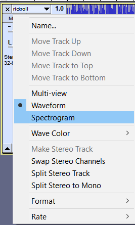
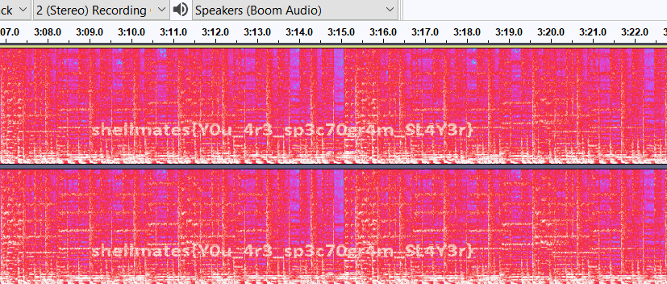

# rickroll

## Write-up

After hearing the music you should notice some weird noise,  
Using ``Audacity`` or ``Sonic Visualizer`` you can show the `spectorgram` to verify the frequencies then you will find the flag as below:  




```
Hello there! Bring your Cofee.. and take your flag !
```



## Flag

`shellmates{Y0u_4r3_sp3c70gr4m_SL4Y3r}`
