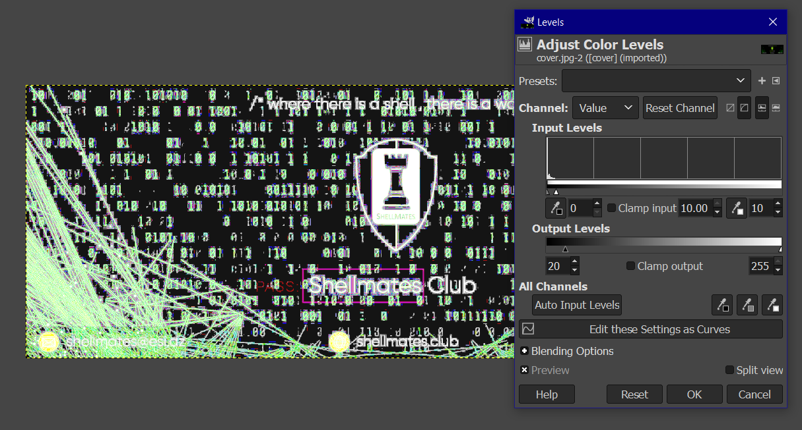
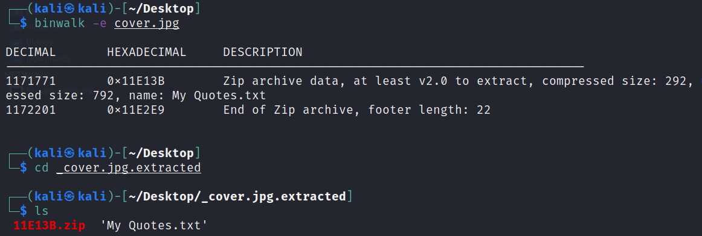
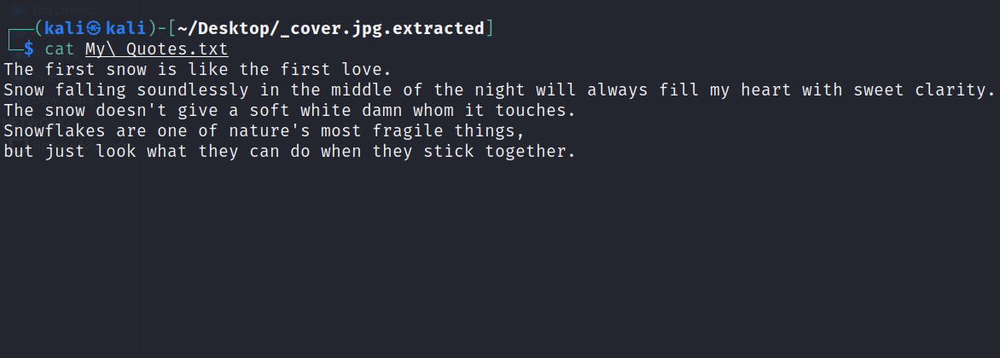
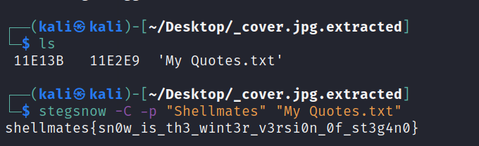

# Skiing

## Write-up

### **Step 01**:

The ``rar`` file is protected with a strong password, but not all files! exactly the `readme.md`.  
this file contains ``Braille Alphabet`` ciphertext  

    ⠏⠺⠙⠒⠀⠧⠥⠇⠥⠭⠙⠎⠞⠛⠓⠼⠓⠼⠃⠁⠎⠎⠙⠍⠼⠊⠕⠥⠏⠁⠵⠊

using [DCODE](https://www.dcode.fr/braille-alphabet) we can easily get this result:

    PWD:⠀VULUXDSTGH82ASSDM9OUPAZI

 which is the `password` of the other files.

### **Step 02**:
Our folder contains:
```
    /Design
        .Logo_renewed.jpg (~51KB)
        .Community.jpg (~20KB)
        .cover.jpg (~1.11MB)
```
Since Bob is a designer, Let's verify the images using some image editor like [GIMP](https://www.gimp.org/).

    Colors >> Levels

we get this: ``PASS: Shellmates``  
save this password! it will be useful later.
### **Step 03**:
Using ``Binwalk`` we find some hidden files inside the ``cover.jpg`` :
```
    binwalk -e cover.jpg
```



```
    cat My\ Quotes.txt
```



Well! seems that Bob really love Snow and Skiing!
also there is a lot of whitespaces !  
**have you heard before about the Whitespaces steganography ?**  
yes you can hide any text using a tool called ``SNOW``.  
on linux we can use [stegsnow](https://www.kali.org/tools/stegsnow/) to decrypt it using the password that we've found in `Step 02`! 
```
    stegsnow -C -p "Shellmates" "My Quotes.txt"
```

## Flag

`shellmates{sn0w_is_th3_wint3r_v3rsi0n_0f_st3g4n0}`