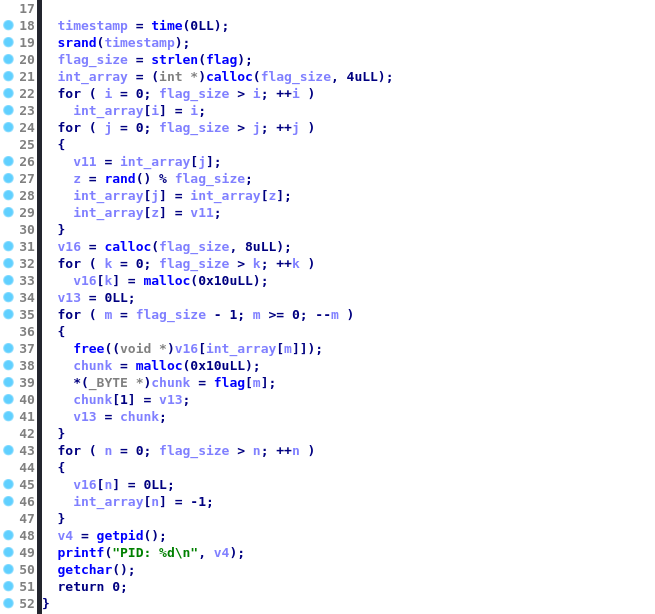

# linked

## Write-up (hfz)
First things first, let's run the `file` command on the binary to have an idea of its properties:
```
┌──(hfz㉿kali)-[~/Infosec/mctf2021/reverse/linked]
└─$ file linked 
linked: ELF 64-bit LSB pie executable, x86-64, version 1 (SYSV), dynamically linked, interpreter /lib64/ld-linux-x86-64.so.2, for GNU/Linux 3.2.0, BuildID[sha1]=e5e2121e40917c67f8c3fb7ba4f434ca76b5f5ba, not stripped
```
We can extract the following useful information:
- It's a 64-bit ELF binary.
- It's dynamically linked (its dependencies aren't shipped with it, hence its small size).
- Most importantly, the binary is not stripped, which means that symbols like function names and global variable names can be found in the binary, giving us a clearer view of its behaviour.

Armed with this knowledge, we can use a tool like `IDA` or `Ghidra` to get a nice decompilation of the binary, I'll stick with `IDA` for this one.  
Once the binary loaded in `IDA`, we can hit the `F5` key in order to decompile a function (e.g., `main`) like shown (some local variable names were manually replaced for convenience):

<p align="center">
  
</p>

The program is not hard to understand, here's what it does:
1. `Lines 18-19` Initialize the PRNG with the local time as a `seed`.
2. `Lines 21-23` Allocate an int array on the heap with `calloc` of size `flag_size`, and set each array element's value to its index.
3. `Lines 24-30` Shuffle the array by swapping the element of index `j` with the element of index `z`, where `z` is pseudo-randomly generated number between `0` and `flag_size` (exclusive).
4. `Line 31` Allocate an array of pointers (notice the second argument to `calloc`, which is the size of a member. And since it's a 64-bit binary, pointers are 64-bit long, or 8-bytes) with as many pointers as there are characters in the flag.
5. `Line 32-33` Allocate `flag_size` heap chunks of size 16-bytes each using `malloc`, and store the returned pointer in the array of pointers allocated in **4**. To summarize, we have an array of size `flag_size` where each element is a pointer to a 16-bytes long chunk (without counting the heap metadata).
6. `Line 34-42` Loop through the allocated chunks in an order determined by the lookup table (the previously shuffled array constructed in **3**), and for each chunk, do the following:
    - Free it by calling `free`. This will place the chunk in a tcache bin of size 32 (16-bytes requested through malloc + 16-bytes of heap metadata) if we're using glibc 2.26 or newer, otherwise, it would be placed in a fast bin (but all these details don't matter too much here).
    - Allocate a heap chunk with the same size of the `free`'d one (16-bytes), this will cause the glibc heap manager to reuse the previously `free`'d chunk that was placed in the tcache.
    - Assign a flag character to the first byte of the chunk payload.
    - Because the pointer returned to malloc wasn't casted, the `chunk` pointer is of type `void *`, which means indexing elements advances in memory with a step of 8-bytes. So `chunk[1]` here starts at offset 8 (relative to the start of the chunk payload). We are assigning the previously treated chunk pointer (`NULL` if it's the first in the loop) to the second member of the struct. We can thus see this structure as follows (this is a typical singly-linked list, and the challenge name is `linked`):
```c
struct A {
	char flag_character;
	A *ptr;
}

// or in a more familiar fashion
struct Node {
	char value;
	Node *next;
}
```
  7. `Lines 43-47` `NULL`ify the array of pointers, and set elements of the shuffled array of indices to `-1` (in order to not leak the characters' order and ruin the purpose of the challenge).
  8. `Lines 48-51` Irrelevant to us (used to pause the program in order to dump the heap).

Step `5` was made solely to shuffle the way the heap chunks would be allocated in the heap, and thus preventing us from looking at the heap in a linear fashion and reading the flag characters one by one.
Once we have a good grasp of the program's behaviour, solving it becomes trivial. We just need to traverse the singly-linked list from its head to its tail, and read the characters as we go.

Solve scripts: [solve.py](./solve.py), [solve.go](./solve.go)

## Flag
`shellmates{U_SuRelY_d1DNT_SK1P_TH3_l1NKeD_list_CLa$$}`
